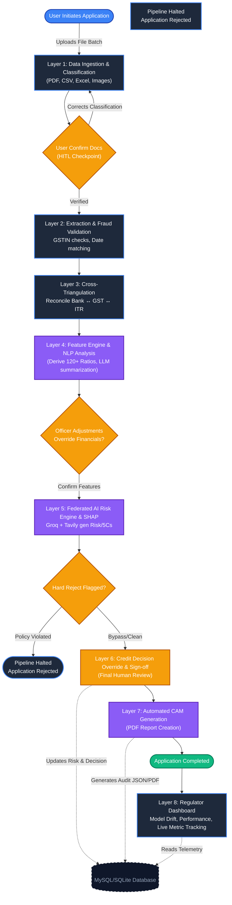

# 🧠 Intelli-Credit System Architecture

## Overview

The Intelli-Credit platform is built using a **layered AI architecture** designed to process financial documents, extract insights, perform risk analysis, and generate a Credit Appraisal Memorandum (CAM).

The system follows an **8-layer pipeline**, ensuring modular processing and strong governance controls.

---

## High-Level Architecture

```

User Upload
↓
Document Ingestion
↓
Extraction & Validation
↓
Financial Cross-Triangulation
↓
Feature Engineering
↓
AI Risk Engine
↓
Human Decision Layer
↓
CAM Generation
↓
Governance Dashboard

```
## 🔄 System Architecture & Data Flow

Our system processes applications through a rigorous 8-Layer Pipeline. 
Below is a high-level mapping of how an application journeys from initial document upload through to final decisioning and governance logging.




---

## Layer 1 — Document Ingestion & Classification

The system accepts multiple input formats including:

- PDF documents
- scanned images
- CSV files
- Excel spreadsheets

Documents are automatically classified based on type:

- bank statements
- GST returns
- financial statements
- legal records

Users verify document classification before processing continues.

---

## Layer 2 — Document Extraction & Validation

The extraction engine parses structured and unstructured financial data.

Processes include:

- OCR for scanned documents
- rule-based extraction
- schema validation
- GSTIN verification
- date validation

Extracted data is normalized into structured JSON schemas.

---

## Layer 3 — Cross-Triangulation

Financial data from different sources is cross-verified.

Examples include:

- GST turnover vs bank credits
- ITR revenue vs financial statements
- transaction patterns vs reported revenue

This helps detect:

- revenue inflation
- circular trading
- inconsistencies in financial reporting

---

## Layer 4 — Feature Engineering & NLP

This layer derives over **100 financial indicators** including:

- profitability ratios
- leverage ratios
- liquidity ratios
- revenue growth metrics

Natural Language Processing analyzes qualitative text such as:

- auditor notes
- management commentary
- regulatory disclosures

---

## Layer 5 — Federated AI Risk Engine

The AI engine evaluates borrower risk using:

- financial indicators
- external research signals
- qualitative insights

Outputs include:

- risk score
- probability of default
- five Cs of credit assessment

Explainability mechanisms highlight the factors influencing each score.

---

## Layer 6 — Human-in-the-Loop Decision Layer

Credit officers review AI recommendations.

Users may:

- approve AI decisions
- modify loan limits
- override recommendations

Overrides require justification and digital authorization.

---

## Layer 7 — CAM Generation

The system generates a **Credit Appraisal Memorandum (CAM)** containing:

- borrower details
- financial analysis
- AI insights
- credit decision summary

Reports can be exported as:

- PDF
- DOCX
- JSON

---

## Layer 8 — Governance & Monitoring

The governance layer tracks system performance and model behavior.

Key monitoring functions include:

- model performance metrics
- risk distribution monitoring
- decision history logging
- model drift detection

This ensures transparency, accountability, and long-term system reliability.

---

## Technology Stack

### Backend
- Python
- Flask
- Flask-SocketIO
- Groq API
- Tavily Web Search API

### Data Layer
- MySQL / SQLite
- JSON schemas
- structured financial datasets

### Frontend
- HTML / CSS / JavaScript
- Chart.js
- DataTables

---

## Design Principles

The Intelli-Credit architecture follows these core principles:

1. **Explainability** — AI decisions must be transparent.
2. **Human Oversight** — final credit decisions remain human-controlled.
3. **Modularity** — each processing stage operates independently.
4. **Scalability** — system can handle large document volumes.
5. **Governance** — audit trails and monitoring ensure responsible AI deployment.

---

## Conclusion

The Intelli-Credit architecture combines **document intelligence, explainable AI, financial analytics, and governance controls** to build a comprehensive credit decisioning system capable of modernizing corporate lending workflows.