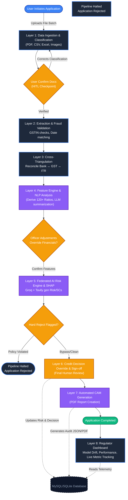

<div align="center">

# 🏦 Intelli-Credit: AI-Driven MSME Credit Decisioning Engine

**An enterprise-grade, end-to-end automated Credit Appraisal Pipeline powered by Federated AI, Large Language Models, and strict Regulatory Governance.**

[](https://python.org)
[](https://flask.palletsprojects.com/)
[](https://groq.com/)
[](https://tavily.com/)
[](https://socket.io/)

</div>

---

## 📖 Executive Summary
The **Intelli-Credit Decisioning Engine** is designed to eliminate the manual bottleneck of MSME credit appraisals. It automatically ingests, validates, and processes unstructured financial documents (Bank Statements, GST Returns, ITRs, Audited Financials) through an 8-layer AI pipeline. 

The system leverages extremely fast LLM inference via the **Groq API** to synthetically extract and summarize financial data, apply a federated risk scoring model (with SHAP feature explainability), and automatically generate a regulatory-grade **Credit Appraisal Memorandum (CAM)** while enforcing strict Human-in-the-Loop (HITL) checkpoints. Additionally, it uses the **Tavily Web Search API** to fetch up-to-date industry context to strengthen the AI's credit analyses.

Key capabilities include:
- 📄 **Multi-modal Document Ingestion** (PDF, CSV, Images) and authenticity verification via external APIs (e.g., GSTIN validation).
- 🧠 **Dynamic Generative AI Scoring** with Groq-powered LLMs determining Risk Categories and the "5Cs of Credit".
- 🌐 **Web Grounded AI Insights** powered by Tavily, enriching the LLM's understanding with real-world news and market data.
- ⚖️ **Regulatory Compliance Explanations (SHAP)** that visually and textually detail exactly *why* an AI score was granted.
- 🧑‍💻 **Human-in-the-loop (HITL)** safeguards for overriding critical policy rules and finalizing credit decisions with cryptographically simulated digital signatures.
- 📉 **Layer 8 Governance Dashboard** tracking Model Drift, SMA/CRILC alerts, and live risk metrics for RBI compliance.

---

## 🛤️ End-to-End Workflow: What Happens When You Upload?

1. **Document Upload & Ingestion (Layer 1):** The user uploads a batch of MSME financial documents (PDFs, CSVs, Excel, Images) via the UI. The system automatically classifies each document type. 
   - **HITL Checkpoint 1 (Document Review):** The user verifies the AI's document classification and can manually reassign document types if incorrect before proceeding. *(Solves: Contextual "Garbage In, Garbage Out" errors, preventing incorrectly classified documents from corrupting the downstream pipeline.)*
2. **Extraction & Validation (Layer 2 & 3):** Data is extracted via local parsing or OCR. It validates authenticity (e.g., GSTIN checks) and cross-triangulates values across different sources (reconciling Bank Statements with GST Returns).
   - **HITL Checkpoint 2 (Data Verification):** The user reviews the extracted key data points (e.g., account numbers, GSTIN, dates) for accuracy and can correct any OCR/parsing errors. *(Solves: OCR hallucinations and extraction failures, ensuring the foundational numerical data model is 100% accurate before moving to the scoring engine.)*
3. **Feature Engineering & NLP (Layer 4):** Over 120 key financial ratios and indicators are derived. NLP parses qualitative data like auditor notes or management commentary.
   - **HITL Checkpoint 3 (Ratio Calibration):** The user can review the AI-derived financial ratios and qualitative summaries, adjusting specific inputs or weights based on unique business context not captured in the documents. *(Solves: Algorithmic rigidity, allowing human officers to inject offline knowledge, such as cyclical business nuances, directly into the quantitative model.)*
4. **Federated AI Scoring & Context (Layer 5):** The Groq LLM evaluates the aggregated profile to generate a risk category and assess the "5Cs of Credit". Tavily Web Search fetches recent industry news, while SHAP values explicitly explain the key factors driving the AI's score.
   - **HITL Checkpoint 4 (Pre-Condition Review):** If the AI flags potential hard-reject conditions (e.g., adverse news, major policy violations), the system halts. An authorized user must review these flags and explicitly decide to clean/bypass them or formally reject the application. *(Solves: Auto-rejection anxiety and strict regulatory compliance issues, guaranteeing that severe exceptions and negative flags are always arbitrated by a human.)*
5. **Final Decision & Sign-off (Layer 6):** An authorized Credit Officer reviews the AI's final recommendation and comprehensive explanations. They can accept the AI's decision or execute a hard-override by providing detailed justification and signing off with a digital signature.
6. **Automated CAM Generation (Layer 7):** A comprehensive, regulatory-grade Credit Appraisal Memorandum (CAM) report is auto-generated as a PDF, documenting the financials, AI insights, and final human decision.
7. **Governance & Auditing (Layer 8):** The finalized application telemetry is routed to the L8 Governance dashboard, continuously tracking model drift, performance metrics, and risk distributions for compliance purposes.

---

## 🌟 Additional Enterprise Features
Beyond the core AI scoring engine, Intelli-Credit ships with a suite of enterprise-grade auxiliary systems to ensure security, auditability, and team collaboration:

- 🖋️ **Digital Signaturing (Maker-Checker):** Cryptographically enforced sign-offs required by authorized Credit Officers before an AI decision is finalized, ensuring accountability.
- 🕒 **Comprehensive History & Audit Logs:** A dedicated, searchable Application History view (powered by DataTables) that retains full historical records, decisions, AI explanations, and CAM reports for every processed application.
- 👥 **User Management System:** Administrators can seamlessly onboard new loan officers, analysts, and managers, assigning them direct platform access.
- 🔐 **Dynamic Role Hierarchy & RBAC:** Fine-grained Role-Based Access Control allowing institutions to dynamically create and assign custom roles (e.g., *Junior Analyst*, *Senior Officer*). The system enforces hierarchical permissions, determining who can bypass AI hard-rejects or execute pipeline overrides.

---

## 🔄 System Architecture & Data Flow

Our system processes applications through a rigorous 8-Layer Pipeline. 
Below is a high-level mapping of how an application journeys from initial document upload through to final decisioning and governance logging.



---

## 🛠️ Stack & Technologies

### Backend Engine
- **Framework:** Python Flask handles REST APIs and core internal application routing.
- **Websockets:** `Flask-SocketIO` is used to stream real-time pipeline progress, logs, and state directly to the client interface layer by layer.
- **AI/LLM Engine:** Ultra-fast remote inference powered by the **Groq API** to execute reasoning logic. **Tavily API** provides deep web-search context injections to supplement the LLM's background knowledge on industry sectors.
- **Database:** Standard SQL (`MySQL/SQLite` abstraction layer via Python`mysql.connector`/`sqlite3`) tracking user configurations, application payloads, final CAM data, and RBAC policies.

### Frontend Dashboard
- **HTML/CSS/JS:** Vanilla web technologies with no heavy, restrictive framework requirements. 
- **Theming:** Bespoke variable-driven CSS custom properties designed for a cohesive dark UI.
- **Charting & Data:** Interactive data visualization libraries utilizing `Chart.js` (for SHAP / Model Composition charts), and `DataTables.js` (with fully integrated search and date range filters) for History data management.
- **Icons:** `Lucide` beautiful SVG icon integration.

---

## 📂 Project Structure
```text
Intelli-Credit/
│
├── app.py                      # Main Flask orchestration system & API routing
├── config.py                   # Environment & Database variables
├── database.py / db.py         # DB Initialization and schema setups
├── federated_scoring.py        # Central AI inference orchestration (Groq API + Tavily)
├── create_database.py          # Setup script to construct DB tables
│
├── layer2/                     # Layer 2: Document Extraction & Fraud Validation
│   ├── extractors/             # OCR and data ingestion rules (Bank, ITR, GST)
│   ├── schemas/                # Standardized JSON definitions for extraction
│   └── utils/                  # Document parsing helpers
│
├── layer3/                     # Layer 3: Cross-Triangulation
│   └── (Reconciliation logic mapping sales/revenues across sources)
│
├── layer4/                     # Layer 4: Feature Engine & NLP Analysis
│   ├── consolidation/          # Merging arrays into unified data models
│   ├── forensics/              # Checking for related-party transactions
│   ├── qualitative/            # LLM-based parsing of management/auditor notes
│   └── research/               # Market/Industry research aggregation (Tavily)
│
├── layer5/                     # Layer 5: Federated AI Risk Engine
│   └── models/                 # Dynamic risk scoring prompts and ML logic calls
│
├── layer7/                     # Layer 7: Automated CAM Generation 
│   └── (PDF builder and Audit JSON creation logic)
│
├── layer8/                     # Layer 8: Governance & Dashboard Telemetry
│   ├── block_a_model_registry.py  # Tracks LLM Versions and Model History
│   ├── block_b_performance.py     # Accuracy, Precision, Recall metrics
│   ├── block_c_imv.py             # Independent Model Validation 
│   ├── block_e_shap.py            # Global level SHAP tracking across portfolio
│   ├── block_j_dashboard.py       # API logic fetching final L8 dashboard payloads
│   └── ... 
│
├── static/                     # Frontend Assets
│   ├── css/
│   │   └── style.css           # Custom Intelli-Credit design system 
│   ├── js/
│   │   └── dashboard.js        # Core WebSockets client logic, UI handling
│   └── uploads/                # Temporary processing directory for PDFs/Images
│
├── templates/                  # Jinja Web Views
│   ├── dashboard.html          # Main SPA (Single Page App) Dashboard
│   └── ui_login.html           # Mock Login interface
│
├── tests/                      # Unit testing and integration suites
└── requirements.txt            # Python environment dependencies
```
## 🔑 Key Capabilities Implemented:

### Technical Depth

* 8-layer architecture
* document intelligence
* financial reconciliation
* AI risk engine
* explainability
* CAM generation

### Governance & Compliance

* audit logs
* history tracking
* governance dashboard
* model monitoring

### Human Trust Layer

* Human-in-the-loop
* override warnings
* decision summary updates

### Enterprise Platform Features

* RBAC
* dynamic roles
* user management
* maker-checker signoff

### Intelligence Layer

* web research (Tavily)
* explainable risk scoring
* SHAP-like reasoning
* LLM summarization
---
### “Why Our System Is Better Than Current Credit Appraisal”


| Current System      | Intelli-Credit     |
| ------------------- | ------------------ |
| Manual analysis     | Automated pipeline |
| Weeks of processing | Minutes            |
| Human bias          | Explainable AI     |
| Scattered documents | Unified CAM        |


---

## 🖥️ System Demo

---

## 🚀 Installation & Setup

1. **Clone the Repository:**
   ```bash
   git clone https://github.com/your-org/intelli-credit.git
   cd intelli-credit
   ```

2. **Install Python Dependencies:**
   Ensure you have Python 3.10+ installed.
   ```bash
   pip install -r requirements.txt
   ```

3. **Configure API Keys:**
   Create a `.env` file or export your required API keys:
   ```bash
   export GROQ_API_KEY="gsk_your_key_here"
   export TAVILY_API_KEY="tvly_your_key_here"
   ```

4. **Database Initialization (First Run Only):**
   *(Note: The system utilizes either abstract local SQLite databases or connects via your MySQL configuration if provided in config.py)*
   ```bash
   python create_database.py
   ```

5. **Start the Application Server:**
   ```bash
   python app.py
   ```
   *The server uses SocketIO and threads to support asynchronous pipeline operations. By default, it will operate on `http://127.0.0.1:5000`.*

---
*Developed by PraxisCode X for the Intelli-Credit Challenge.*
