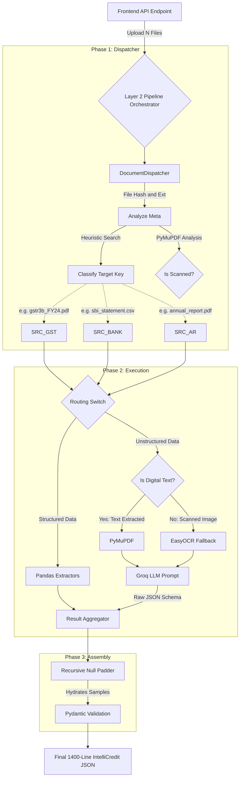

# Layer 2: Document Processing Engine

This module is the core extraction brain of the Intelli-Credit System. It ingests an arbitrary array of `N` documents (digital PDFs, scanned PDFs, CSVs, Excel files), normalizes them, routes them to deterministic or AI extractors, and perfectly assembles a strictly-validated 1400-line JSON output.

## System Flowchart

Here is the exact step-by-step logic of how Layer 2 processes files.



---

## How to integrate with a Frontend (FastAPI / Flask)

Layer 2 is designed to accept an arbitrary list of file paths. It doesn't matter what the user names the files or what order they upload them in. `DocumentDispatcher` will correctly identify them using heuristics (like matching the word "statement" to `SRC_BANK`).

### 1. Example FastAPI Endpoint

Here is exactly how your Python backend should accept files from a React/Vue frontend and pass them into Layer 2.

```python
from fastapi import FastAPI, UploadFile, File
from typing import List
import os
import shutil
from layer2.layer2_processor import IntelliCreditPipeline

app = FastAPI()
pipeline = IntelliCreditPipeline()

@app.post("/api/v1/process_documents")
async def process_documents(
    case_id: str, 
    company_name: str, 
    files: List[UploadFile] = File(...)
):
    # 1. Save all uploaded files to a temporary workspace
    temp_dir = f"./temp_workspace/{case_id}"
    os.makedirs(temp_dir, exist_ok=True)
    
    filepaths = []
    
    for file in files:
        file_location = f"{temp_dir}/{file.filename}"
        with open(file_location, "wb+") as file_object:
            shutil.copyfileobj(file.file, file_object)
        filepaths.append(file_location)
        
    # 2. Hand the array of filepaths off to Layer 2
    try:
        # Layer 2 routes, extracts, validates, and builds the 1400-line JSON
        result_json = pipeline.process_files(
            filepaths=filepaths, 
            case_id=case_id, 
            company_name=company_name
        )
        
        # 3. Serialize Pydantic object to HTTP JSON Response
        return result_json.model_dump()
        
    except Exception as e:
        return {"status": "error", "message": str(e)}
        
    finally:
        # 4. Cleanup the physical files from the server
        shutil.rmtree(temp_dir)
```

### 2. Frontend React/Axios Call Example

From your frontend interface, you just append all files to a single `FormData` object and POST it:

```javascript
async function uploadDocuments(caseId, companyName, fileArray) {
    const formData = new FormData();
    
    // Append simple metadata
    formData.append('case_id', caseId);
    formData.append('company_name', companyName);
    
    // Append N files
    fileArray.forEach(file => {
        formData.append('files', file); 
    });

    try {
        const response = await axios.post(
            'http://localhost:8000/api/v1/process_documents', 
            formData, 
            { headers: { 'Content-Type': 'multipart/form-data' } }
        );
        
        console.log("Success! Layer 2 1400-line payload:", response.data);
        return response.data;
        
    } catch (error) {
        console.error("Extraction failed", error);
    }
}
```

### Why this architecture is powerful:
- **No manual mapping needed**: The user doesn't have to specify "this file is the Bank Statement." They just drag and drop 15 files, and Layer 2's Dispatcher hashes and heuristically classifies them.
- **Fail-safe Schema Guardrails**: If a user uploads an invalid file, or if the Groq LLM hallucinated, Pydantic's strict model generation will either pad it with `null`s or throw an exception, protecting your Database / Layer 3.
